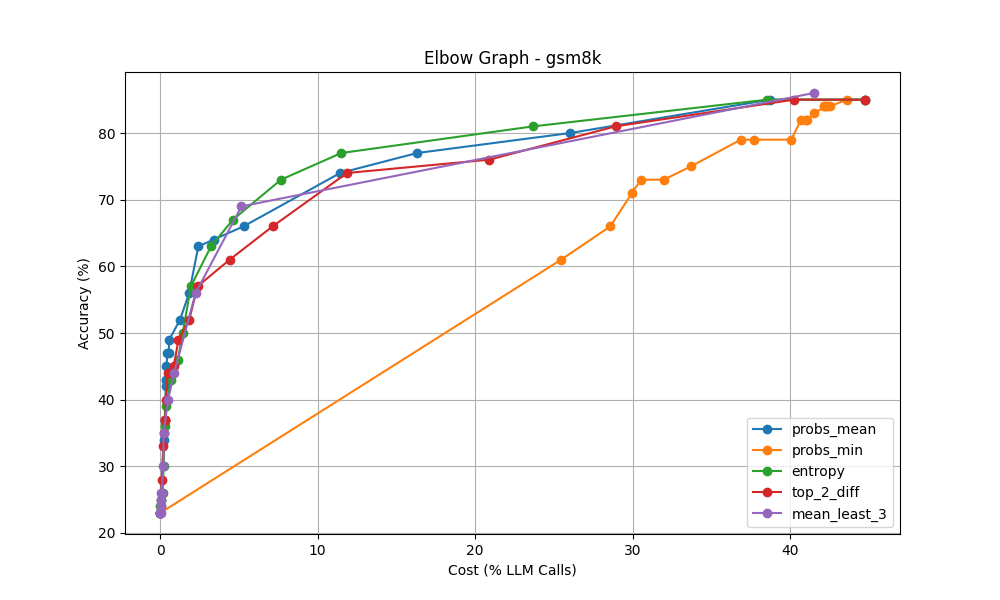
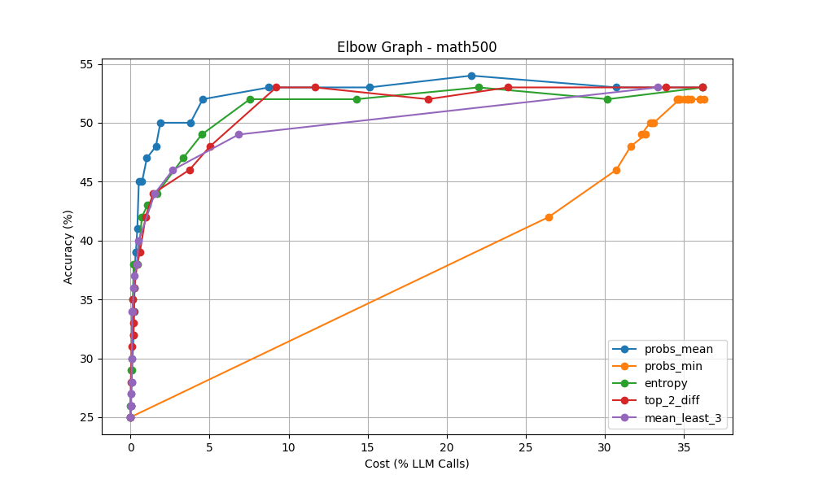
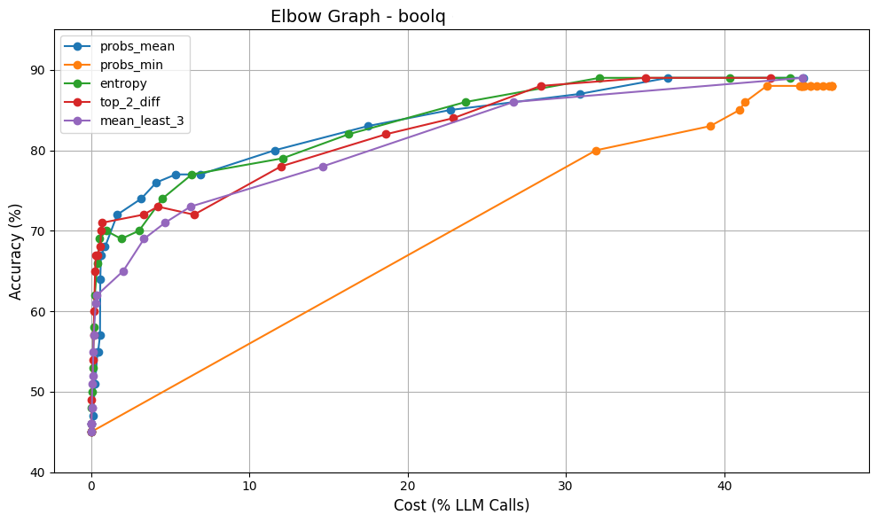

# Speculative RAG: SMARTER 🚀

### **S**urgical **M**ulti-drafting **A**ugmented **R**etrieval with **T**hreshold-**E**nabled **R**ecovery

[](https://opensource.org/licenses/Apache-2.0)
[](https://www.python.org/downloads/)
[]()

**SMARTER** is a high-performance implementation of Speculative RAG that improves upon the methodology presented in *"Guiding Reasoning in Small Language Models with LLM Assistance"* (arXiv: 2504.09923). By replacing computationally expensive Process Reward Models (PRMs) with lightweight **Statistical Surgical Interventions**, SMARTER achieves 7B-level reasoning accuracy while maintaining the inference efficiency of a 1.5B model.

---

## ✨ Key Contributions

- **PRM-less Efficiency**: Replaces heavy reward models with token-level statistical confidence metrics, drastically reducing compute overhead during verification.
- **Statistical Bottleneck Detection**: Introduces a diverse suite of scoring methods to identify "reasoning failures" in real-time:
  - **Entropy**: Measures token uncertainty across the distribution.
  - **Top-2 Difference**: Captures the "margin of error" between competing tokens.
  - **Mean Least-3**: A sensitivity-focused metric targeting low-probability outliers.
  - **Probs Mean/Min**: Standard confidence aggregates.
- **Automated Calibration Engine**: Built-in logic that automatically sweeps across datasets (GSM8K, MATH-500, BoolQ) to identify the "winner" scoring strategy and the optimal confidence threshold.
- **GPU Adaptive Design**: Optimized for H100 and A100 infrastructure with batch-parallel drafting and surgical intervention.

---

## 🏗️ Technical Architecture

SMARTER operates on a **Draft-Score-Intervene** loop:

1.  **Drafter (SLM)**: A 1.5B model generates a full candidate response.
2.  **Surgical Chunking**: The draft is split into discrete reasoning steps (delimited by `\n\n`).
3.  **Confidence Scoring**: Each step is evaluated against a calibrated statistical threshold.
4.  **Surgical Intervention**: If a step falls below the threshold, a larger **LLM (7B)** intervenes to regenerate only that specific reasoning bottleneck.
5.  **Resumption**: The SLM resumes generation from the LLM’s corrected state, preventing error propagation.

---

## 📊 Performance Results

### **Accuracy Comparison**
SMARTER consistently bridges the gap between Small (1.8B) and Large (7B) models, often reaching >95% of the LLM's performance at a fraction of the cost.

| Benchmark | Qwen1.5-1.8B (Baseline) | Qwen1.5-7B (Baseline) | **SMARTER (Ours)** |
| :--- | :---: | :---: | :---: |
| **GSM8K** | 38.4% | 91.3% | **86.0%** |
| **MATH-500** | ~33.4% | ~55.6% | **54.0%** |
| **BoolQ** | 64.5% | 93.1% | **89.0%** |

### **The "Elbow" Curves**
The following graphs illustrate the trade-off between **Accuracy** and **LLM Usage (Cost)**. SMARTER identifies the "Optimal Knee" where we achieve maximum accuracy with minimal LLM calls.

| GSM8K | MATH-500 | BoolQ |
| :---: | :---: | :---: |
|  |  |  |

---

## ⚙️ Configuration & Calibration

All execution parameters and model paths are managed via `recipes/`. Key performance data is stored in:

- **[`calibration_summary.json`](output/calibration_summary.json)**: This file tracks the performance of every scoring method across different thresholds. It is used to automatically select the "Best Config" for each dataset.
- **`recipes/qwen_test.yaml`**: Main configuration for inference runs, including `n` (draft count) and `num_iterations`.

### **Optimal Calibration Results**
From our latest benchmark run:
- **GSM8K**: `mean_least_3` strategy (Threshold: 8.9e-05)
- **MATH-500**: `probs_mean` strategy (Threshold: 0.86)
- **BoolQ**: `entropy` strategy (Threshold: 0.43)


## 📚 Citation
If you use this project in your research, please cite the original SMART paper and this implementation:
```bibtex
@article{smarter2025,
  title={Speculative RAG: SMARTER - Surgical Multi-drafting Augmented Retrieval with Threshold-Enabled Recovery},
  author={Shivang Karthikey},
  journal={arXiv preprint arXiv:2504.09923 (SMART Improvement)},
  year={2026}
}
```
