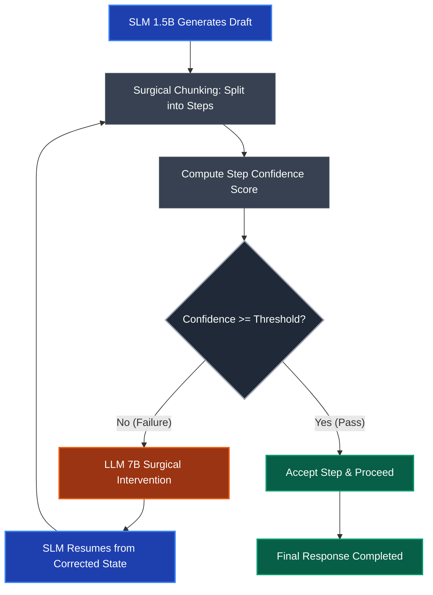

<div align="center">

# SMARTER 🧠

### **S**urgical **M**ulti-drafting **A**ugmented **R**etrieval with **T**hreshold-**E**nabled **R**ecovery

<p>
  <a href="https://opensource.org/licenses/Apache-2.0"></a>
  <a href="https://www.python.org/downloads/"></a>
  <a href="https://arxiv.org/abs/2504.09923"></a>
  
  
</p>

<p><em>Achieving 7B-class reasoning accuracy at 1.5B inference cost — without Process Reward Models.</em></p>

</div>

---

## 📖 Overview

**SMARTER** is a high-performance Speculative RAG framework that extends and improves the methodology from *"Guiding Reasoning in Small Language Models with LLM Assistance"* ([arXiv:2504.09923](https://arxiv.org/abs/2504.09923)).

The core insight: **you don't need an expensive Process Reward Model (PRM)** to detect reasoning failures in real-time. By replacing PRMs with lightweight **Statistical Surgical Interventions**, SMARTER achieves near-7B reasoning quality while maintaining the inference throughput of a 1.5B model — drastically reducing both compute cost and latency.

> **TL;DR** — A 1.5B Small Language Model (SLM) handles the bulk of generation. A statistical confidence monitor watches every reasoning step. When a step is uncertain, a 7B Large Language Model (LLM) surgically regenerates *only that step*. The SLM then resumes, fully corrected.

---

## ✨ Key Contributions

| Contribution | Description |
|---|---|
| **PRM-Free Verification** | Replaces heavy reward models with token-level statistical confidence metrics, eliminating a major inference bottleneck |
| **Statistical Bottleneck Detection** | A suite of 5 scoring strategies that identify reasoning failures in real-time without auxiliary model calls |
| **Automated Calibration Engine** | Built-in sweep logic that finds the optimal confidence strategy and threshold per dataset automatically |
| **GPU-Adaptive Drafting** | Batch-parallel draft generation optimized for H100/A100 multi-GPU setups |
| **Surgical Step Intervention** | Step-granular LLM intervention that prevents error propagation without discarding correct reasoning |

---

## 🏗️ System Architecture

SMARTER operates on an iterative **Draft → Score → Intervene** loop:



### Confidence Scoring Methods

SMARTER includes 5 calibrated statistical strategies. The **Calibration Engine** automatically selects the best one per dataset:

| Strategy | Description | Best For |
|---|---|---|
| `entropy` | Measures token uncertainty across the full distribution | Reasoning ambiguity detection |
| `top2_diff` | Captures the margin between the top-2 candidate tokens | Sharp decision boundaries |
| `mean_least_3` | Targets low-probability outlier tokens | Sensitivity to subtle failures |
| `probs_mean` | Standard mean confidence aggregate | Stable, balanced scoring |
| `probs_min` | Minimum token confidence in a step | Conservative failure detection |

---

## 📊 Benchmark Results

SMARTER consistently **bridges the accuracy gap** between small and large models, reaching >95% of 7B performance at a fraction of the inference cost.

### Accuracy Comparison

| Benchmark | Qwen1.5-1.8B (SLM Baseline) | Qwen1.5-7B (LLM Baseline) | **SMARTER** | Gap Closed |
|:---|:---:|:---:|:---:|:---:|
| **GSM8K** | 38.4% | 91.3% | **86.0%** | ~91% |
| **MATH-500** | ~33.4% | ~55.6% | **54.0%** | ~92% |
| **BoolQ** | 64.5% | 93.1% | **89.0%** | ~86% |

### Optimal Calibration Configuration

From our latest full benchmark run, the Calibration Engine selected:

| Dataset | Strategy | Threshold | Accuracy |
|:---|:---|:---:|:---:|
| **GSM8K** | `mean_least_3` | `8.9e-05` | 86.0% |
| **MATH-500** | `probs_mean` | `0.86` | 54.0% |
| **BoolQ** | `entropy` | `0.43` | 89.0% |

### Accuracy–Cost Trade-off ("Elbow" Curves)

The graphs below illustrate the trade-off between **Accuracy** and **LLM Usage Rate (cost)**. SMARTER's calibration engine identifies the optimal knee point — maximum accuracy, minimum expensive LLM calls.

| GSM8K | MATH-500 | BoolQ |
|:---:|:---:|:---:|
|  |  |  |

---

## 🚀 Getting Started

### Prerequisites

- Python **3.10+**
- CUDA-compatible GPU (tested on **H100 / A100**)
- ~50 GB disk space for model weights

### 1. Clone & Install

```bash
git clone https://github.com/your-username/SMARTER.git
cd SMARTER

pip install -r requirements.txt
```

> **Note:** `numpy<2.0.0` is pinned as the last install to prevent compatibility breakage with vLLM and Outlines.

### 2. Run the Full Pipeline (Recommended)

The single-command entrypoint runs calibration followed by full benchmark evaluation:

```bash
bash run.sh
```

This executes:
1. **Calibration sweep** — 300 samples per dataset, across all 5 scoring strategies
2. **Threshold selection** — picks the optimal strategy/threshold via utility-based elbow detection
3. **Full evaluation** — runs the final benchmark on the complete datasets

### 3. Run Calibration Only

Manually sweep thresholds and identify the best configuration:

```bash
python scripts/calibrate.py \
    --datasets "gsm8k,math500,boolq" \
    --num_calibration_samples 100
```

Results are saved to `output/calibration_summary.json`.

### 4. Run Final Benchmark

Execute SMARTER using pre-computed optimal thresholds:

```bash
bash scripts/run_final_benchmark.sh
```

### 5. Advanced: Model-Specific Runs

```bash
# Qwen models
bash run_qwen.sh

# LLaMA models
bash run_llama.sh
```

---

## 📁 Project Structure

```
SMARTER/
├── scripts/
│   ├── calibrate.py              # Threshold calibration sweep
│   ├── run_final_pipeline.py     # Full end-to-end SMARTER pipeline
│   ├── run_benchmarks.py         # Benchmark evaluation driver
│   ├── run_llm_only.py           # LLM-only baseline runner
│   ├── generate_report.py        # Report generation utilities
│   ├── run_final_benchmark.sh    # Final benchmark shell entrypoint
│   └── run_mini_test.sh          # Quick smoke test
│
├── src/
│   ├── sal/                      # Core Search-and-Learn library
│   └── evaluation/               # Evaluation utilities and metrics
│
├── recipes/
│   └── qwen_test.yaml            # Model configuration (paths, n, iterations)
│
├── output/
│   ├── calibration_summary.json  # Calibration results for all strategies
│   ├── elbow_gsm8k.png           # Accuracy-cost trade-off curve (GSM8K)
│   ├── elbow_math500.png         # Accuracy-cost trade-off curve (MATH-500)
│   └── elbow_boolq.png           # Accuracy-cost trade-off curve (BoolQ)
│
├── documents/                    # Reference papers and documentation
├── notes/                        # Experiment notes and analysis
├── run.sh                        # Main pipeline entrypoint
├── run_qwen.sh                   # Qwen-specific runner
├── run_llama.sh                  # LLaMA-specific runner
└── requirements.txt              # Pinned dependencies
```

---

## ⚙️ Configuration

All model paths and hyperparameters are managed in `recipes/qwen_test.yaml`. Key parameters:

| Parameter | Description |
|---|---|
| `n` | Number of draft candidates generated per query |
| `num_iterations` | Surgical intervention retry limit |
| `slm_model` | Path to the 1.5B / 1.8B Small Language Model |
| `llm_model` | Path to the 7B Large Language Model |
| `elbow_method` | Threshold selection strategy (`"utility"` recommended) |

---

## 🔬 Methodology

SMARTER builds upon the SMART framework ([arXiv:2504.09923](https://arxiv.org/abs/2504.09923)) with three primary innovations:

1. **Elimination of PRMs** — Process Reward Models are replaced entirely by statistical confidence metrics computed directly on the SLM's token log-probabilities. This removes a significant inference cost with no accuracy regression.

2. **Surgical Chunking** — Responses are segmented at `\n\n` boundaries into discrete reasoning steps. The LLM only ever sees and regenerates the specific failed step, not the entire context.

3. **Automated Calibration** — Rather than manually tuning thresholds, SMARTER sweeps all 5 scoring strategies across a calibration split and uses a utility-based elbow-detection algorithm to identify the globally optimal configuration per dataset.

---

## 📚 Citation

If you use SMARTER in your research, please cite both the original SMART paper and this work:

```bibtex
@article{smart2025,
  title   = {Guiding Reasoning in Small Language Models with LLM Assistance},
  author  = {Authors of SMART},
  journal = {arXiv preprint arXiv:2504.09923},
  year    = {2025}
}

@misc{smarter2026,
  title  = {SMARTER: Surgical Multi-drafting Augmented Retrieval with Threshold-Enabled Recovery},
  author = {Karthikey, Shivang},
  note   = {PRM-free speculative RAG implementation improving upon arXiv:2504.09923},
  year   = {2026}
}
```

---

## 📜 License

This project is licensed under the **Apache 2.0 License** — see the [LICENSE](LICENSE) file for details.

---

<div align="center">
  <sub>Built at the intersection of inference efficiency and reasoning quality.</sub>
</div>
