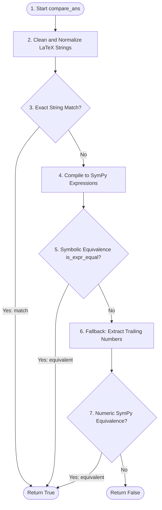

# `evaluation/math_utils.py` — SymPy Parsing and Comparison Utilities

## What Is This File?

This file contains parsing and mathematical comparison utilities designed to normalize LaTeX-formatted math outputs and check equivalence between predictions and labels using `sympy` evaluation.

---

## Main Entry Point

### `compare_ans(ans_p_str, ans_l_str, is_strict=False)`
The main function invoked by the grader to check if a prediction matches the ground truth.
* **Arguments**:
  * `ans_p_str` (`str`): Predicted answer string.
  * `ans_l_str` (`str`): Reference label answer string.
  * `is_strict` (`bool`): If `True`, skips soft equivalence heuristics.
* **Returns**: `bool` (`True` if equivalent, `False` otherwise).

---

## Execution Flow inside `compare_ans`

When `compare_ans` evaluates a prediction and a reference, it processes them in the following order:

1. **LaTeX Standardization**: Runs both strings through `clean_expr_str` to normalize LaTeX operators and strip formatting symbols (like `$` or commas).
2. **Exact String Match**: Checks if the sanitized string representations are identical (`ans_p_str.replace(" ", "") == ans_l_str.replace(" ", "")`).
   * *This acts as a fast-path that returns immediately for text-based or binary targets (like BoolQ's `"yes"`/`"no"`).*
3. **SymPy Parsing**: If string matching fails, it attempts to parse both strings into symbolic expression trees using `parse_latex_answer`.
4. **Symbolic Comparison**: Checks algebraic equivalence via `is_expr_equal`. It compares variables, checks equation bounds, and leverages SymPy's `.equals()` solver.
5. **Numerical Fallback**: If symbolic parsing fails or does not match, it uses `extract_answer_number` to search for trailing numbers, converts them, and compares them again using floating-point proximity.

---

## Helper Functions

* **`clean_expr_str(expr_str)`**: Applies regex replacements to sanitize brackets (`\left`), normalize roots (`\sqrt`), change division tokens, and standardise inequality signs.
* **`my_parse_latex(expr_str)`**: Wraps SymPy's `parse_latex` and maps constants (like `pi` and complex root `i` (`I`)) to their mathematical representations.
* **`parse_latex_answer(sample)`**: Converts a LaTeX string into a compiled SymPy expression.
* **`is_expr_equal(ans_p, ans_l, is_strict)`**: Compares two SymPy objects for mathematical equivalence (handling free symbols and equations).
* **`compare_numerical_ans(ans_p, ans_l)`**: Compares floating-point values directly using a tolerance margin of `< 1e-3`.
* **`extract_answer_number(sentence)`**: Extracts numbers using regular expressions.
* **`percentage_to_fraction(text)`**: Converts percentage tokens into floats.
* **`vote(answers)`**: Selects the majority class in a list of candidate answers.
* **`rough_compare_ans(generation, answer)`**: Falls back to word-level proximity checks.

---

## Pipeline Integration Status

### 1. Active Alternative
In the active evaluation pipeline (`evaluate.py`), this file is **not actively imported or used**. The pipeline instead relies directly on **`src/evaluation/grader.py`** to perform symbolic and numeric checks (via `math_equal`).

### 2. Rationale: Why It Exists Standalone
* **Legacy Reference Code**: `math_utils.py` contains a separate, alternative implementation of LaTeX cleanup and SymPy representation parsing compiled during development.
* **Specialized Utilities**: It maintains auxiliary utilities that are not needed by the core grader but are useful for independent research scripts, such as:
  * `vote()` for majority voting checks.
  * `percentage_to_fraction()` for resolving percent symbols.
  * `rough_compare_ans()` for fuzzy output matching.

### 3. Handling BoolQ (If Swapped)
If the runner were modified to call `compare_ans()` in `math_utils.py`, it would successfully grade **BoolQ** predictions because it performs an exact string match check at the very beginning of the evaluation loop (`ans_p_str.replace(" ", "") == ans_l_str.replace(" ", "")`). Since BoolQ answers are simple binary texts (`"yes"` or `"no"`), they trigger this fast-path immediately and bypass any SymPy logic.
