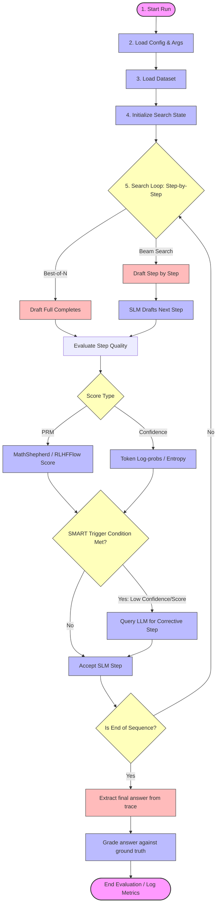

# Project Workflow & Architecture

This document describes the overall workflow of the **SMARTER** project. It details the process from configuration parsing and dataset loading, through speculative decoding search variants, up to evaluation and scoring.

---

## High-Level Workflow Diagram

The diagram below shows how the generation, verification (PRM or Confidence-based), and speculative mediation (LLM intervention) flow together.



---

## Execution Modes & Entry Points

The SMARTER repository supports two distinct execution flows depending on the desired operation mode:

### A. Speculative Decoding Search & Calibration Flow (`src/sal/`)
* **Entry Scripts**: `test_time_compute.py` or `calibrate.py` (see [best_of_n.md](file:///Users/shivangkarthikey/Desktop/BTP_sem4/SMARTER/documents/sal/search/best_of_n.md)).
* **Focus**: Executes token-level speculatively mediated search (SMART), calling generator models, scorer checkpoints, and trigger gates.
* **Ingestion**: Directly uses `src/sal/utils/data.py` (which formats targets and incorporates reading comprehension setups like BoolQ few-shot prompts).

### B. Offline Baseline Evaluation Flow (`src/evaluation/`)
* **Entry Script**: `math_eval.py` (see [math_eval.md](file:///Users/shivangkarthikey/Desktop/BTP_sem4/SMARTER/documents/evaluation/math_eval.md)).
* **Focus**: Evaluates basic model prompting capability (standard Chain-of-Thought, Program-Aided Language, or Tool-use).
* **Ingestion & Output**: Orchestrates data caching (via `data_loader.py`), few-shot formatting (via `examples.py`), interactive Python execution loops, and grades final completions (via `evaluate.py` and `grader.py`).

---

## Detailed Step-by-Step Execution

### 1. Initialization and Parameter Mapping
- **Config Loader**: The pipeline is initialized using configurations parsed from YAML files and CLI arguments (see [parser.md](file:///Users/shivangkarthikey/Desktop/BTP_sem4/SMARTER/documents/sal/utils/parser.md)). This determines parameters such as the active generator models, thresholds, temperatures, candidate quantities ($N$ or beam width), and evaluation targets.
- **Dataset Preparation**: The loader fetches reasoning datasets (such as GSM8K, MATH, or SVAMP) locally or from the Hugging Face Hub, indexing and caching samples into standardized schemas.

### 2. Search Strategies (Generation & Pruning)
The workflow branches into one of two main generation strategies:
- **Best-of-N**: Generates $N$ complete pathways in parallel. It calculates scores after paths are drafted.
- **Beam Search**: Evaluates step quality incrementally at each reasoning step, pruning low-scoring pathways to retain only the top beams.

### 3. Verification & Scoring Methods
Each reasoning step is evaluated using one of two scoring frameworks:
- **Process Reward Models (PRMs)**: Leverages specialized models (e.g., MathShepherd or RLHFFlow) to assign a numerical value indicating step correctness.
- **Token-Level Confidence**: Inspects the SLM's output token probability distributions to identify points of high model uncertainty (e.g. low log-probabilities or high entropy).

### 4. Speculative Mediation (SMART)
During active generation, if the quality scorer returns a score below the threshold, the pipeline triggers the **SMART** mechanism:
- **Intervention**: The generation halts, and the query is redirected to a larger, more capable model (LLM).
- **Correction**: The LLM edits or replaces the low-confidence step, returning a corrected reasoning trace.
- **Resumption**: The SLM resumes generation from the corrected checkpoint, avoiding cascading reasoning errors.

### 5. Offline Evaluation & Metric Aggregation Flow

Once the model finishes generating completions, the offline evaluation pipeline executes the following sequential steps to grade predictions and compile statistics:

1. **Runner Entry (`math_eval.py`)**:
   * Prepares prompts, executes LLM generation (using CoT, PAL/PoT, or Tool-Integrated styles), and calls Python code blocks if necessary.
   * Saves the raw generated answers to `{out_file}.jsonl`.
   * Invokes the core orchestrator: `evaluate(samples=all_samples, ...)` from `evaluate.py`.

2. **Orchestrator Loop (`evaluate.py`)**:
   * For each sample, it runs `parse_ground_truth()` and `extract_answer()` from `parser.py` to clean and extract the final predicted output (e.g., matching text inside standard `\boxed{}` tags).
   * Submits the extracted predictions and ground truths to `math_equal_process()` for verification.

3. **Equivalence Judge (`grader.py`)**:
   * Receives prediction-reference pairs. 
   * First, checks for **Exact Text Equivalence**:
     ```python
     if str(prediction.strip().lower()) == str(reference.strip().lower()):
         return True
     ```
     *(This is the fast-path that evaluates binary datasets like BoolQ immediately without mathematical overhead).*
   * If exact text match fails, it falls back to **Numerical Equivalence** (float proximity with relative tolerance) and **Symbolic Equivalence** (compiling expressions using SymPy and `latex2sympy`).

4. **Metrics Output**:
   * `evaluate.py` returns the evaluated samples (tagged with `correct` boolean values) and summary metrics back to `math_eval.py`.
   * `math_eval.py` writes the final metric summary JSON to `{out_file}_metrics.json` (containing average accuracy, timing metrics, and timeout counts).
